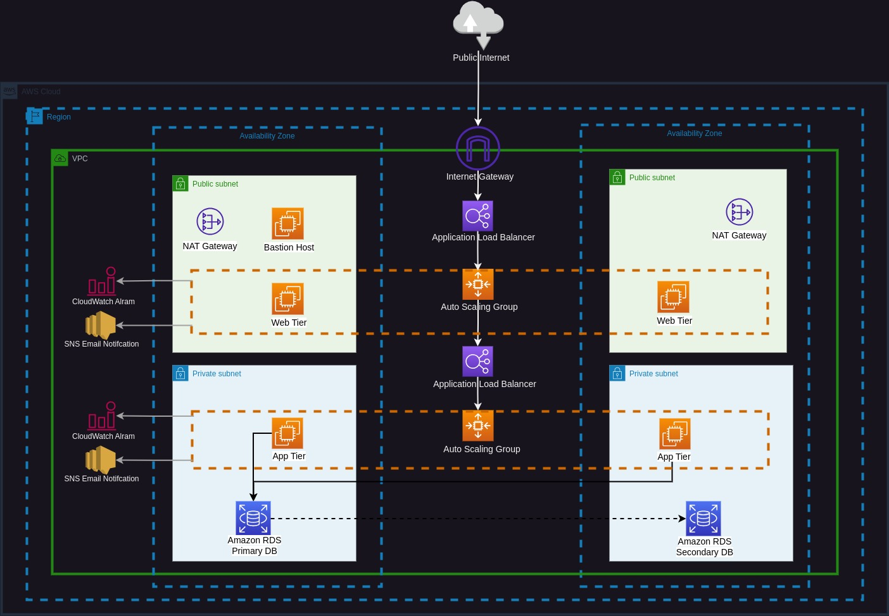

# README

This repository contains Terraform code to create resources in AWS for Autoscaling and Application Load Balancing of a three-tier app with a bastion host. The infrastructure includes a bastion host, a web server, an application server, and an RDS instance. The bastion host, web server, and application server are deployed in a public subnet, while the RDS instance is deployed in a private subnet.

Additionally, the setup includes SNS and CloudWatch to automatically add and remove instances in the autoscaling group based on scaling policies.

## Architecture



## Prerequisites

Before using this Terraform code, ensure that you have the following prerequisites:

- AWS CLI installed and configured with appropriate credentials.
- Terraform installed on your local machine.

## Getting Started

To get started, follow these steps:

1. Clone this repository:

```bash
git clone https://github.com/sundesz/terraform-3tier-with-elb-autoscaling-bastionhost.git
cd terraform-3tier-with-elb-autoscaling-bastionhost
```

2. Set up the necessary AWS credentials either by configuring the AWS CLI or by manually providing the required credentials.

3. Review and modify the `variables.tf` file to customize the configuration if needed.

4. Initialize the Terraform working directory:

```bash
terraform init
```

5. Validate the Terraform configuration:

```bash
terraform validate
```

6. Create an execution plan:

```bash
terraform plan
```

7. If the plan looks good, apply the Terraform configuration to create the infrastructure:

```bash
terraform apply
```

8. Confirm the execution by typing `yes` when prompted.

9. Wait for the Terraform deployment to complete. It may take a few minutes.

10. After the infrastructure is deployed, Terraform will display the outputs defined in `outputs.tf`. Make note of these outputs as they contain important information about the created resources.

## Accessing the Infrastructure

To access the infrastructure, you can use the following:

- **Bastion Host**: The bastion host is accessible via SSH using the auto-generated key pair (`aws_test_key.pem`). The public IP address and SSH command are displayed in the Terraform outputs.

- **Web Server and Application Server**: The web server and application server can be accessed through the bastion host. Connect to the bastion host using SSH, then SSH into the web server or application server from there.

- **RDS Instance**: The RDS instance is deployed in the private subnet and

cannot be accessed directly from the internet. It can be accessed from the web server or application server within the VPC.

## Cleaning Up

To clean up and destroy the created resources, run the following command:

```bash
terraform destroy
```

Confirm the destruction by typing `yes` when prompted.

**Note:** This action will permanently delete all the resources created by Terraform.

## Disclaimer

Please note that the code provided in this repository is for demonstration purposes only. It may not be production-ready and may not follow all security best practices. Use it at your own risk.

For more information about using Terraform with AWS, please refer to the official [Terraform documentation](https://www.terraform.io/docs/providers/aws/index.html).

For any issues or questions, please create an issue on the [GitHub repository](https://github.com/sundesz/terraform-3tier-with-elb-autoscaling-bastionhost).

**Happy coding!**
